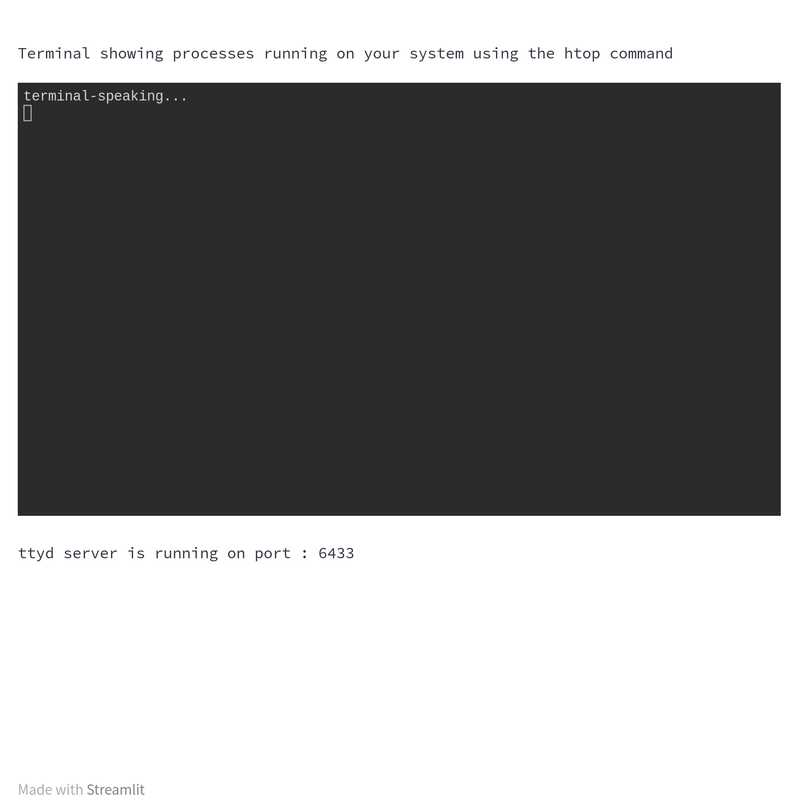

# streamlit_ttyd

streamlit_ttyd implements a terminal plugin for streamlit using the amazing [ttyd](https://github.com/tsl0922/ttyd) project.
As of now, only Linux like platforms are supported.
Open an issue if you need support for windows or other platforms. 

### Installation

`pip install git+https://github.com/NeveIsa/streamlit_ttyd`


### Usage

```python
import streamlit as st
from streamlit_ttyd import terminal
import time 

st.text("Terminal showing processes running on your system using the top command")

# start the ttyd server and display the terminal on streamlit
ttydprocess, port = terminal(cmd="top")

# info on ttyd port
st.text(f"ttyd server is running on port : {port}")

# kill the ttyd server after a minute
time.sleep(60)
ttydprocess.kill()
```

### Demo 
---

---

> Arguments for terminal()

- cmd: str -> the command to run 
- readonly: bool -> readonly terminal (default -> False)
- host: str -> protocol://hostname where streamlit server is run (default -> http://localhost)
- port: int -> port number to run the ttyd server on (default -> 0, automatically picked in the range 5000-7000)
- exit_on_disconnect -> whether to kill ttyd server when web-terminal is disconnected (default -> True)
- height: int -> height in pixels which is passed to streamlit.component.v1.iframe (default -> 500)
